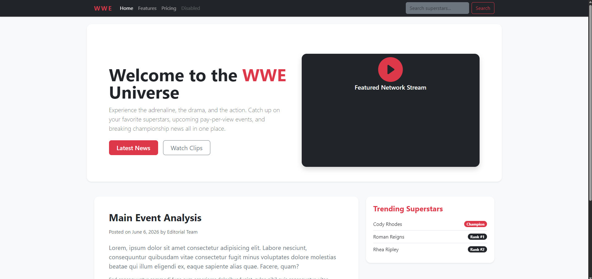

# 🌐 Bootstrap 5 Responsive Navbar & Layout Lab

A clean, modern boilerplate designed to master the fundamentals of **Bootstrap 5.3**. This project demonstrates how to transition a plain HTML document into a production-ready, fully responsive web interface featuring a sleek fixed navigation system, a dynamic hero banner, and a classic two-column grid layout.

---

## 📸 Screenshots

### Desktop View
*A sleek two-column layout with a fixed dark navbar, hero banner, content card, and sticky sidebar tracking widgets.*



---

## 🚀 Key Learning Features Included

* **Fixed Header Layout:** Implements `.fixed-top` seamlessly with custom structural body padding configurations in the CSS file to prevent running text from overlapping underneath the navigation layer.
* **Responsive Component Architecture:** Deploys interactive search forms, brand alignment mechanics using flex properties (`me-auto`), and an automatic collapsing accordion burger menu wrapper (`.collapse.navbar-collapse`) targeting specified breakpoints (`lg` / `992px`).
* **Modern Core Layout Utilities:** Showcases deep use of responsive gutters (`g-4`), explicit layout wrappers (`.container`), elevated card boundaries (`shadow-sm`), rounded modern corners (`rounded-4`), and smooth transition states.
* **WWE Aesthetic Variant:** Bridges utility styling with raw design implementation, utilizing high-contrast configurations (`bg-dark`, `text-danger`) paired with clean component pill badges.

---

## 🛠️ Tech Stack & Dependencies

No compilation or build setup required! Simply clone and run instantly using any standard web browser stream or development live-server extension.

* **Core Languages:** HTML5, CSS3
* **Framework:** Bootstrap v5.3.3 (Delivered via high-performance cloud CDN)
* **Iconography:** Bootstrap Icons v1.11.3 (Delivered via cloud CDN)

---

## 📂 Project Structure

```text
├── index.html       # Structurally styled page containing navbar, hero layout, and grids
├── style5.css       # Custom layout overrides, body padding offsets, and animations
└── README.md        # Documentation and overview lab guide
